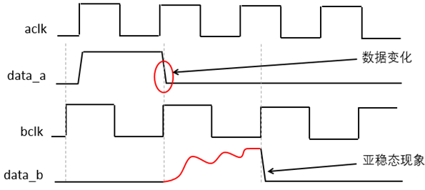
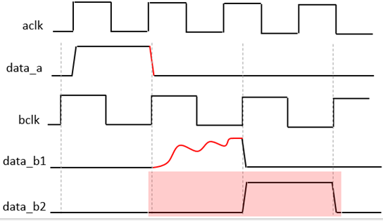
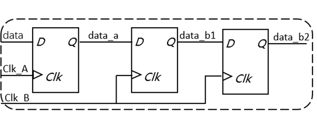
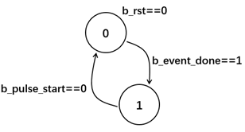
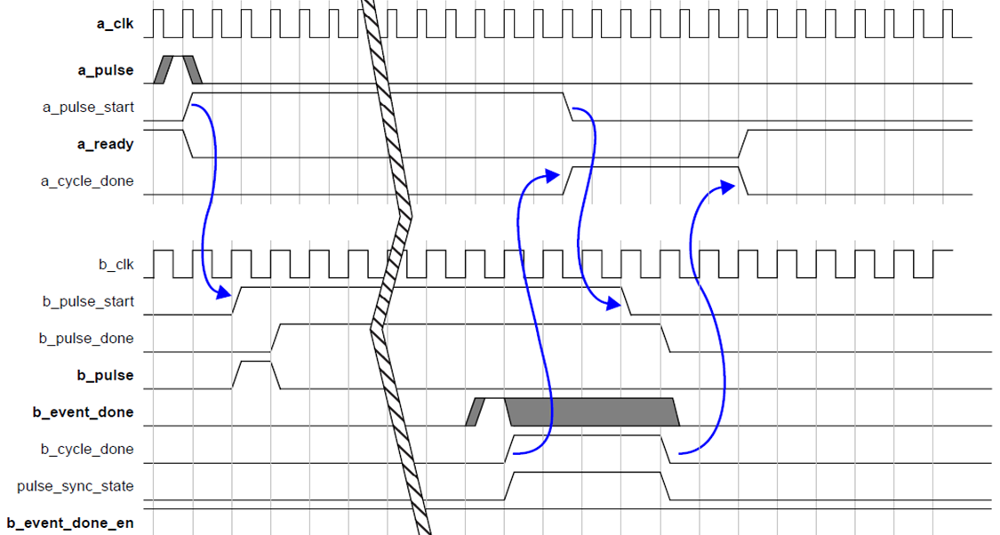
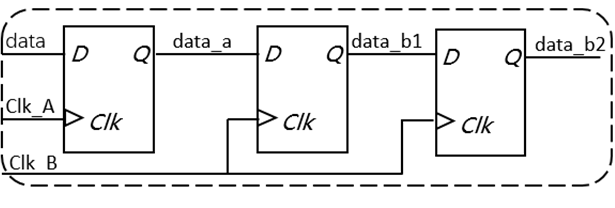
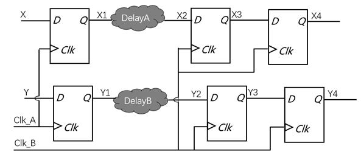
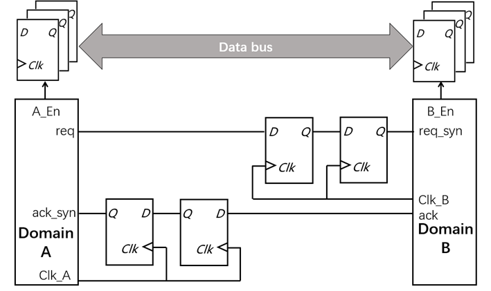

## 跨时钟问题(Clock Domain Crossing)

### 亚稳态

产生原因：

​	跨时钟域数据不满足目标时钟的建立保持时间

解决方案：

​	两级或多级同步器隔离亚稳态

* 亚稳态无法消除
* 亚稳态只能被隔离，降低发生概率
* 两级同步器之间不要有组合逻辑

### 数据保持（快时钟域到慢时钟域）

产生原因：

​	数据从快时钟域到慢时钟域，数据保持的时间较短，无法被慢时钟域采样

解决方案

* 数据展宽
* 脉冲同步器

数据展宽

脉冲同步器（也适用于低频时钟域到高频时钟域）

1. 时钟域A中采样a_pulse后保持
2. 电平信号送到时钟域B中同步并生成脉冲信号b_pulse
3. 在时钟域A中生成的电平信号需要复位，在时钟域B中生成的复位信号，b_cycle_done产生
4. b_cycle_done送到时钟域A中同步，产生复位信号

特点：

* 异步复位
* 响应信号，具有握手机制
* 测试模式信号

### 数据冗余（慢时钟域到快时钟域）

产生原因：

​	数据从慢时钟域到快时钟域，数据在目标时钟域被多次采样

解决方案：

* 脉冲同步器
* 边沿检测

边沿检测

### 数据相关性丢失

产生原因

​	延迟与时钟不确定性令目标时钟域采样无效数据

解决方案

* 格雷码编码
* 握手机制
* 异步FIFO
* 门控机制

多位控制信号解决方案

数据相关，按顺序依次变化，地址指针或状态机的状态矢量

解决方案：

格雷码编码

相邻数据间转换时，只有一位产生变化，地址范或状态数量为2^n个

二进制编码

| **D0** | **0** | **0** | **0** | **0** | **1** | **1** | **1** | **1** |
| ------ | ----- | ----- | ----- | ----- | ----- | ----- | ----- | ----- |
| **D1** | **0** | **0** | **1** | **1** | **0** | **0** | **1** | **1** |
| **D2** | **0** | **1** | **0** | **1** | **0** | **1** | **0** | **1** |

格雷码编码

| **D0** | **0** | **0** | **0** | **0** | **1** | **1** | **1** | **1** |
| ------ | ----- | ----- | ----- | ----- | ----- | ----- | ----- | ----- |
| **D1** | **0** | **0** | **1** | **1** | **1** | **1** | **0** | **0** |
| **D2** | **0** | **1** | **1** | **0** | **0** | **1** | **1** | **0** |

数据信号解决方案

* 异步FIFO
* 握手协议
* 使能信号控制

异步FIFO

* 读写指针用格雷码编码后同步
* “空信号”在读时钟域产生
* “满信号”在写时钟域产生

握手协议

* 'req'信号同步至Clk_B
* 'ack'信号同步至Clk_A
* 数据保持直到握手完成

### 复位信号的同步

### 无毛刺时钟切换（Glitch Free Clock MUX）

